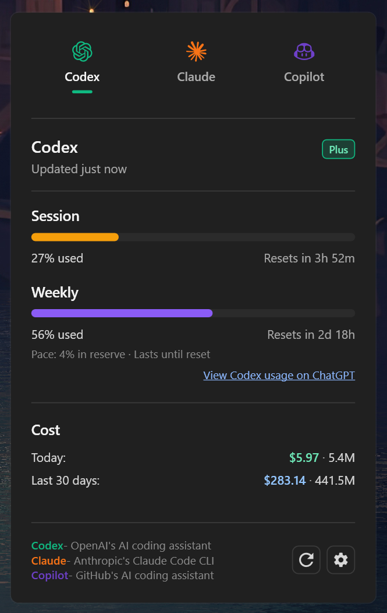

# costats 

A lightweight Windows tray app that shows live status, plus token usage and spend, for AI coding providers like Codex and Claude Code, optionally GitHub Copilot and Cursor.

<p align="center">
  
</p>

## What it shows
- Session and weekly utilization with reset timers and pace indicators.
- Daily tokens + cost and 30-day rolling tokens + cost.
- Overage or credit balance when available.
- One-tap tray widget and a global hotkey (`Ctrl+Alt+U`).

## Install

**One-step PowerShell (technical)**
```powershell
iwr -useb https://raw.githubusercontent.com/RileyCornelius/costats/master/scripts/install.ps1 | iex
```
Downloads the latest release, installs per-user and creates a Start Menu shortcut.
Portable installs now auto-check for updates in the background on startup and stage updates safely for the next launch.

**From source:** see **Build** below.

## Usage
- Click the tray icon to open the widget.
- Press `Ctrl+Alt+U` to toggle the widget (configurable).
- Open Settings to set refresh interval or start at login.

## Configuration
Settings are stored at:
`%LOCALAPPDATA%\costats\settings.json`

Common settings:
- `RefreshMinutes` (default 5)
- `Hotkey` (default `Ctrl+Alt+U`)
- `StartAtLogin` (true/false)
- `CopilotEnabled` (true/false)
- `CursorEnabled` (true/false)

## GitHub Copilot
1. Create a **classic** GitHub personal access token with the **`copilot`** and **`read:user`** scopes.
2. Open Settings → Copilot, enable the provider, and paste the token.
3. Tokens are stored in Windows Credential Manager (not in `settings.json`).
4. This relies on an unofficial GitHub endpoint and may break without notice.

More details in [docs/COPILOT.md](docs/COPILOT.md).

## Cursor
1. Open Settings → Cursor and enable the provider.
2. If Cursor is installed and signed in on this machine, the session token is detected automatically from Cursor's local state database — no setup needed.
3. Otherwise, paste the `WorkosCursorSessionToken` cookie from cursor.com into Settings → Cursor. Tokens are stored in Windows Credential Manager.
4. This relies on unofficial cursor.com web endpoints and may break without notice.

Setup and troubleshooting details in [docs/CURSOR.md](docs/CURSOR.md).

## Data sources
- Codex usage: OAuth usage endpoint via `~/.codex/auth.json` (or `CODEX_HOME`), with local logs as a fallback for estimates.
- Claude usage: OAuth usage endpoint via `~/.claude/.credentials.json`, with local logs as a fallback for estimates.
- Copilot usage: GitHub Copilot usage endpoint via a personal access token stored in Windows Credential Manager, with local Copilot OTEL logs for cost estimates.
- Cursor usage: cursor.com usage endpoints via the local Cursor session token (auto-detected) or a manually pasted browser cookie.
- Token + cost estimates: local JSONL logs from `~/.codex/sessions` and `~/.claude/projects`.

## Insights Card CLI
Generate a shareable Claude Code Insights card from your Claude Code usage report:

```powershell
npx costats ccinsights
```

See [docs/INSIGHTS.md](docs/INSIGHTS.md) for defaults, flags, and requirements.

## Build
Requires a .NET SDK that supports `net10.0-windows`.
Versioning is centralized via `src/Directory.Build.props` (`VersionPrefix` in `major.minor.patch` format).

```powershell
# Build
dotnet build .\costats.sln -c Release

# Publish portable single-file binaries (x64 + arm64), with .sha256 checksums
.\scripts\publish.ps1
```

## Release

```powershell
# 1. Bump the version
.\scripts\bump-version.ps1 -Version 1.5.2

# 2. Commit the bump
git add src/Directory.Build.props
git commit -m "Bump v1.5.2"

# 3. Push the branch and the release tag
git push origin master
git tag v1.5.2
git push origin v1.5.2 # <- triggers the Release workflow
```

## Linux/MacOS
- [CodexBar](https://github.com/steipete/CodexBar) is an original MacOS/Linux app for stats.
